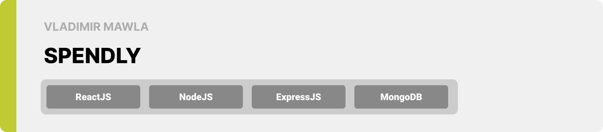

<div align="center">

> Hello world! This is the project’s summary that describes the project plain and simple, limited to the space available.

**[PROJECT PHILOSOPHY](#project-philosophy) • [WIREFRAMES](#wireframes) • [TECH STACK](#tech-stack) • [IMPLEMENTATION](#implementation) • [HOW TO RUN?](#how-to-run)**

</div>

<br><br>


> SPENDLY is a website where users can track their income flow of donations and expenses, save the relative documents, and access their overall statistics

### User Stories

- As a user, I want to browse my transactions, so that I can edit or add to them supporting documents
- As a user, I want to import or export my data, so that i have the option of using them inside or outside the website
- As a user, I want to opt in or out from being publicly visible, so that i can change how users and non users can see my statistics

<br><br>


> This design was planned before on paper, then moved to Figma app for the fine details.
> | User Dashboard | Expenses |
> | -----------------| -----|
> |  |  |

<br><br>


Here's a brief high-level overview of the tech stack SPENDLY uses:

- The design of the app adheres to the material design guidelines.
- This project uses the [React](https://reactjs.org/) library. React is a open-source front-end JavaScript library for building user interfaces based on UI components.
- This project uses the [Express JS](https://expressjs.com/) web framework. Express JS is a web application framework that provides you with an API to build websites, web apps and back ends.
- For persistent data, the app uses [mongoDB](https://www.mongodb.com/). MongoDB is a document-oriented NoSQL database used for high volume data storage.
- This project uses the [Mongoose](https://mongoosejs.com/) library. Mongoose is an Object Data Modeling (ODM) library for MongoDB and Node. js. It manages relationships between data, provides schema validation, and many other utilities.

<br><br>


> Using the above mentioned tech stacks and the wireframes build with figma from the user stories we have, the implementation of the app is shown as below, these are screenshots from the real app

<table>
   <tr>
    <td>Landing Page</td>
    <td>Dashboard</td>
   </tr>
   <tr>
    <td></td>
    <td></td>
   </tr>
   <tr>
    <td>Income Page</td>
    <td>Expense Documents</td>
   </tr>
   <tr>
    <td></td>
    <td></td>
   </tr>
   <tr>
    <td>Profile Page</td>
    <td>Discover</td>
   </tr> 
   <tr>
    <td></td>
    <td></td>
   </tr>
</table>

<br><br>


To get a local copy up and running follow these simple example steps.

### Prerequisites

This is a list of things you need to run the software and how to install them.

1. download and install NodeJS

2. update npm

```sh
npm install npm@latest -g
```

### Installation

1. Clone the repo
   ```sh
   git clone https://github.com/vladimir-mawla/SPENDLY.git
   ```
2. Install NPM packages
   ```sh
   cd backend
   npm install
   cd ../frontend
   npm install
   ```
3. Enter your configurations in `./backend/.env.development` for example:
   ```env
   PORT = 5000
   MONGO_URI = mongodb://127.0.0.1:27017/expense-tracker-db
   ```
4. Seed the DB then run the backend
   ```sh
   npm run seed
   npm run dev
   ```
5. Run the frontend
   ```sh
   npm run start
   ```
